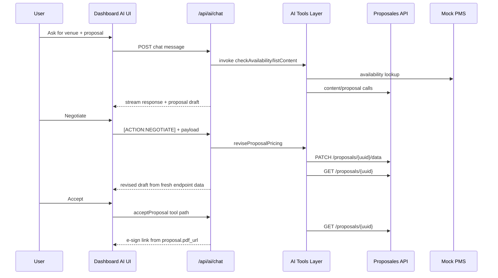
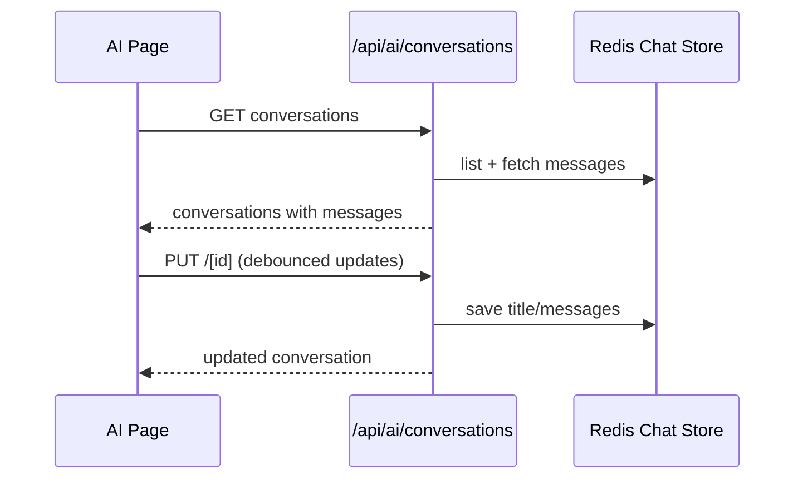

# Proposales Platform — System Design

## 1) Goals and Scope
This document describes the current system design of the Proposales platform implementation, with focus on:
- AI-assisted proposal lifecycle (create, revise/negotiation, accept flow)
- Session-scoped chat persistence
- Content management (CRUD + bulk archive/restore)
- AuthN/AuthZ and role-based behavior
- API surface and endpoint purposes
- Workspace folder structure and responsibilities

---

## 2) High-Level Architecture

### 2.1 Component Diagram
```mermaid
flowchart LR
    U[Browser Client\nNext.js App Router UI] --> A[/API Routes (BFF)\napps/web/app/api/*/]
    A --> P[Proposales API\n(v3 proposals/content/companies/inbox)]
    A --> R[(Redis)\nchat store + pub/sub]
    A --> M[(MongoDB)\nusers/events/bookings/email logs]
    A --> AI[AI Gateway Model\nstreaming + tools]
    A --> PMS[(Mock PMS DB Layer)\navailability/holds/bookings]
    P --> E[eSign Service URL\nproposal.pdf_url]
```

### 2.2 Key Design Choices
- **BFF pattern**: Browser never calls Proposales directly; all calls go through Next.js route handlers.
- **Server-owned conversations**: Chat state is persisted in Redis and hydrated from server on load.
- **Tool-driven AI**: Chat invokes strongly-typed tools; proposal negotiation updates the same proposal via PATCH and then re-reads from API.
- **Direct e-sign URL usage**: eSign is always sourced from `proposal.pdf_url` returned by Proposales.

---

## 3) Core Workflows

### 3.1 AI Proposal Lifecycle Workflow


### 3.2 Conversation Persistence Workflow


### 3.3 Content Management Workflow
1. UI loads content list from `/api/proposales/content` with optional filters.
2. Create/Update/Delete/Bulk operations are sent to same BFF endpoint.
3. Endpoint validates request and forwards to Proposales Content APIs.
4. UI revalidates list after mutation.

---

## 4) Folder Structure and Responsibilities

## 4.1 Workspace Root
- `apps/` — deployable applications (primary web app here)
- `packages/` — shared libraries used by apps
- `docs/` — system and implementation documentation
- `turbo.json` — monorepo task graph
- `vercel.json` — deployment/runtime configuration

### 4.2 apps/web
- `app/` — Next.js App Router pages + API route handlers
  - `dashboard/` — authenticated business UI (AI, proposals, analytics, content, companies, bookings)
  - `api/` — BFF endpoints for AI, Proposales proxying, auth helpers, PMS, webhooks
  - `login/` — passkey + Google OAuth entry
  - `layout.tsx`, `providers.tsx`, `globals.css` — app shell and provider wiring
- `components/` — feature-level UI components (e.g., chat chart rendering)
- `lib/` — runtime modules (auth/session, Redis store, API helpers, hooks, rate limiter, email/pms integrations)
- `middleware.ts` — request interception/auth edge behavior (legacy naming currently flagged by Next.js)

### 4.3 packages/ai
- `src/tools/` — tool definitions used by model (proposal creation, negotiation, customer actions, analytics, PMS)
- `src/prompts/` — system/business prompt templates and behavioral constraints
- `src/index.ts` — tool registry composition for role-specific usage

### 4.4 packages/api-client
- `src/client.ts` — typed client wrapper
- `src/endpoints/` — endpoint call modules grouped by domain
- `src/types/` — shared entities/interfaces (including proposal/content/integration fields)
- `src/validation/` — zod schemas for request/response guards

### 4.5 packages/ui
- `src/primitives/` — low-level reusable controls
- `src/composites/` — composed business UI widgets (data tables, stat cards)
- `src/lib/utils.ts` — UI helper utilities

### 4.6 packages/theme
- Design tokens (colors, spacing, typography) and Tailwind preset

### 4.7 packages/config
- Shared TypeScript presets for app and package builds

---

## 5) Data and State Model

### 5.1 Redis Chat Keys
- `conv:{conversationId}` → metadata (`id`, `title`, `userId`, `createdAt`, `updatedAt`)
- `msgs:{conversationId}` → serialized message list
- `user_convs:{userId}` → ordered conversation IDs per session user

### 5.2 Proposal Negotiation State
- Negotiation updates are patched into proposal `data` (round, discount, final-offer marker, status hint)
- Revised draft shown to user is generated after re-fetching the proposal from endpoint post-patch

### 5.3 Identity and Authorization
- Passkey session and Google OAuth are both supported
- Role split: `sales` (full tools/data) vs customer concierge mode (restricted domain)
- Conversation read/write endpoints enforce ownership checks

---

## 6) Endpoint Catalog (Used in the System)

| Endpoint | Methods | Purpose | Dependency | Key Notes |
|---|---|---|---|---|
| `/api/activity-feed` | GET | Fetch activity feed events | Redis/MongoDB | Auth required |
| `/api/activity-feed/stream` | GET | Real-time SSE feed | Redis pub/sub | Auth required, heartbeat stream |
| `/api/ai/chat` | POST | Streaming AI chat + tool execution | AI Gateway, Proposales SDK, Redis, MongoDB, PMS, rate limiter | Role-based tool set |
| `/api/ai/conversations` | GET, POST | List/create conversations | Redis | Session-scoped data |
| `/api/ai/conversations/[id]` | GET, PUT, DELETE | Read/update/delete one conversation | Redis | Ownership checks |
| `/api/ai/generate-description` | POST | AI-generated proposal description/pricing guidance | AI Gateway, rate limiter | Sales-only endpoint |
| `/api/auth` | POST, DELETE | Passkey login/logout | Cookie/session helpers | Returns role/session state |
| `/api/auth/[...nextauth]` | GET, POST | NextAuth handler | NextAuth, Google OAuth | Delegated framework route |
| `/api/auth/me` | GET | Resolve current user + role | NextAuth + MongoDB | Supports passkey and OAuth sessions |
| `/api/bookings` | GET | List bookings for user | MongoDB | Role/user scoped filtering |
| `/api/email-logs` | GET, POST | Query/create email audit logs | MongoDB | Sales-only; optional proposal filter |
| `/api/events` | GET | List events | MongoDB | Sales sees all, others scoped |
| `/api/mock-pms/availability` | GET | Space availability + price options | PMS DB layer | Requires date + guests |
| `/api/mock-pms/book` | POST | Reserve space booking | PMS DB layer | Used by booking/accept flow |
| `/api/mock-pms/calendar` | GET | Monthly availability calendar | PMS DB layer | Heatmap-style day status |
| `/api/mock-pms/venue` | GET | Venue metadata + slots | PMS DB layer | Public utility endpoint |
| `/api/proposales/attachments` | GET | List attachments | Proposales SDK/API | Auth wrapper |
| `/api/proposales/companies` | GET | List companies | Proposales SDK/API | Auth wrapper |
| `/api/proposales/companies/[companyId]/templates` | GET | List templates for company | Proposales SDK/API | Validates `companyId` |
| `/api/proposales/content` | GET, POST, PUT, DELETE | Content CRUD + bulk archive/restore | Proposales SDK/API | Supports `action=bulk|restore` |
| `/api/proposales/inbox/[token]` | POST | Create RFP via inbox token | Proposales SDK/API | Public webhook-like intake |
| `/api/proposales/proposals` | GET, POST | Search proposals / create proposal | Proposales SDK/API | Supports filter query params |
| `/api/proposales/proposals/[uuid]` | GET, PATCH, PUT | Get proposal / patch proposal data | Proposales SDK/API | PATCH/PUT for data updates |
| `/api/webhooks/proposales` | POST | Handle proposal lifecycle webhooks | Proposales SDK/API, MongoDB, PMS DB | No auth, event-driven side effects |

---

## 7) External Integrations and Their Purpose
- **Proposales API**: source of truth for proposals, content, templates, attachments, inbox/RFP.
- **eSign URL (`proposal.pdf_url`)**: canonical signing/view URL returned by Proposales for sent proposals.
- **Redis**: session-scoped conversation persistence + activity feed streaming channel.
- **MongoDB**: users, events, bookings, email logs, persisted business activity.
- **AI Gateway model**: chat completions and tool orchestration.
- **Mock PMS layer**: internal availability/hold/booking simulation.

---

## 8) Reliability, Security, and Operational Notes
- Route handlers keep secrets server-side; browser receives only needed payloads.
- Conversation endpoints enforce user ownership before update/delete.
- Debounced conversation sync reduces write amplification during streaming responses.
- Negotiation modifies the same proposal UUID through PATCH and then reads fresh state from endpoint.
- Next.js currently warns that `middleware.ts` convention is deprecated in favor of `proxy` naming.
