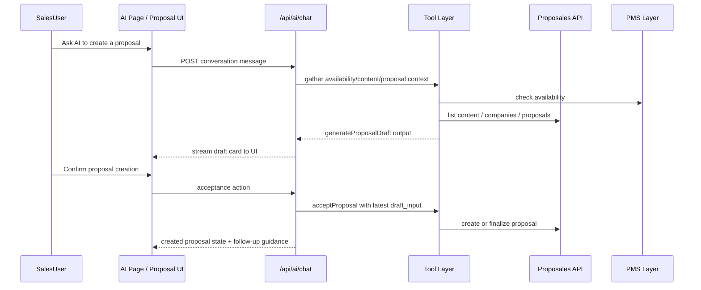
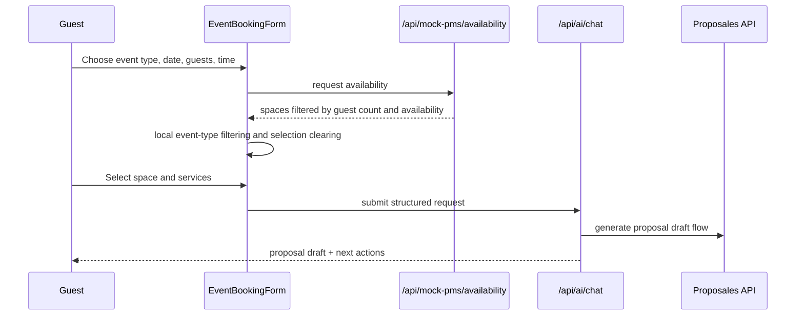
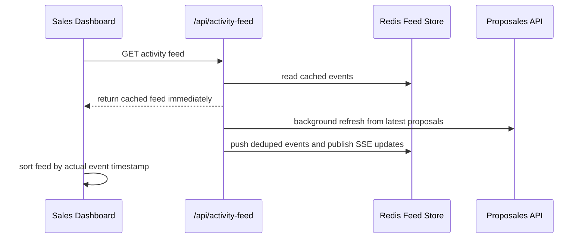

# Proposales Platform — System Design

## 1) Purpose
This document describes the implemented system design of the Proposales platform in its current state. It focuses on:
- Proposales API integration strategy
- Role-based user experience for Sales and Guest users
- AI-assisted proposal and analytics workflows
- Dashboard, proposal, booking, content, and template flows
- Data ownership across Next.js, Proposales, Redis, MongoDB, and the PMS layer
- Performance and operational tradeoffs already implemented in the product

---

## 2) Product Overview
The application is a role-aware proposal platform built on top of Proposales. It provides:
- A public landing page with role/help guidance
- Passkey and Google-based authentication
- A Sales dashboard for pipeline management, AI proposal operations, and insights
- A Guest dashboard for concierge-style AI booking support and proposal tracking
- A Proposales-backed proposal lifecycle with draft, revision, acceptance, and e-sign flows
- A mock PMS layer for space availability, holds, booking simulation, and calendar-based scheduling

The browser never talks to Proposales directly. The application uses Next.js API routes as a backend-for-frontend layer and keeps all external secrets on the server.

---

## 3) High-Level Architecture

### 3.1 Component Diagram
```mermaid
flowchart LR
    U[Browser UI\nLanding + Dashboard + AI + Proposals] --> BFF[/Next.js API Routes\napps/web/app/api/*/]
    BFF --> PROP[Proposales API\nproposals, content, companies, templates, inbox]
    BFF --> AI[AI Gateway Model\nstreaming + tools]
    BFF --> REDIS[(Redis)\nchat store + activity feed + rate limiting]
    BFF --> MONGO[(MongoDB)\nusers + PMS + email logs + user proposals]
    BFF --> PMS[Mock PMS Layer\navailability, holds, booking]
    PROP --> ESIGN[eSign URL\nproposal.pdf_url]
```

### 3.2 Main Architectural Decisions
- BFF-first architecture: all client traffic flows through server-owned routes.
- Proposales as proposal/content source of truth: proposal creation, patching, content lookup, templates, and inbox are driven from Proposales APIs.
- Redis for fast, session-scoped AI conversation persistence and live activity feed fan-out.
- MongoDB for local application records that are not native Proposales entities, such as user proposal references, PMS inventory/holds/bookings, users, and email logs.
- Role-driven AI orchestration: Sales gets analytics + proposal operations; Guests get concierge-style booking support limited to their own data.
- Hybrid availability flow: PMS gives space scheduling/holding behavior while Proposales remains the source of truth for proposal objects and content pricing references.
- Client performance optimizations: reduced polling, deferred search, memoized filtering, and non-blocking activity-feed refreshes.

---

## 4) User Roles and Access Model

### 4.1 Sales Role
Sales users can:
- Access Dashboard, Proposals, Content, Companies, Insights, PMS, and AI Assistant
- Use AI chat for both analytics and proposal generation/revision workflows
- Create proposal drafts, revise pricing, review proposals, and manage pipeline states
- View activity feed, pipeline metrics, board/table proposal views, and company templates
- Use the AI booking form with capacity-aware, event-type-aware space selection

### 4.2 Guest Role
Guest users can:
- Access AI Assistant and My Proposals
- Use concierge AI for hotel/event support limited to their own bookings and proposals
- Use the structured booking form to generate proposal requests
- View proposal history, including withdrawn proposals, via My Proposals
- Select available spaces filtered by event type and guest count

Guest users cannot:
- View sales pipeline analytics or internal business intelligence
- Access other users' proposals or platform-wide proposal metrics

### 4.3 Authentication Modes
The platform supports:
- Passkey-based access using environment-configured passkeys
- Google OAuth through NextAuth

Role resolution comes from:
- Passkey mapping for configured sales/customer users
- Google email matching against `SALES_EMAILS`

---

## 5) Application Surfaces

### 5.1 Landing Page
The landing page includes:
- Product positioning and hero section
- Help section describing Guest vs Sales access and workflows
- Direct shortcut to the Help section from navigation and hero CTA
- Branded app icon/favicon registered via Next.js metadata

### 5.2 Dashboard
The dashboard is role-aware.

Sales dashboard includes:
- Total proposals KPI
- Status distribution card beside total proposals in the first row
- Full-width recent proposals table in the second row
- Darker action styling aligned with the theme
- Live activity feed panel sorted by actual event time
- Navigation item renamed from Analytics to Insights

Guest dashboard experience is intentionally limited and focused on booking/proposal tracking.

### 5.3 AI Assistant Page
The AI page supports:
- Conversation mode with streaming tool-based AI responses
- Form mode for both Sales and Guest users
- Sales AI header and empty-state messaging that explicitly call out proposal generation support
- Voice input support in supported browsers
- Rich tool result rendering, including charts, proposal cards, availability cards, and structured forms

### 5.4 Proposals Page
The proposals module includes:
- Table and Board views
- Board horizontal scrolling
- Board rename from Kanban to Board
- Filters hidden in Board mode
- Search and client-side status filtering in table mode
- AI quick-create and manual draft creation flows

### 5.5 My Proposals Page
Guest proposal tracking includes:
- Proposal list scoped to the current user's email
- Status progression and terminal states
- Withdrawn proposal visibility
- Live enrichment from Proposales proposal data

---

## 6) Core Integrations

### 6.1 Proposales API
The application integrates with Proposales for:
- Proposal search, fetch, create, and patch operations
- Content retrieval for rooms, services, pricing, and reusable blocks
- Company list retrieval
- Company template retrieval
- Attachments and inbox token flows
- Proposal status and e-sign URLs

### 6.2 AI Gateway and Tooling
The AI layer uses:
- Vercel AI SDK streaming flow
- Tool calling against Proposales, PMS, analytics, and internal helpers
- Role-specific tool composition from `packages/ai`

Sales AI can:
- Generate proposal drafts
- Revise pricing/packages
- Analyze proposals and render charts
- Search, patch, and inspect proposals
- Use company/content data while drafting

Guest AI can:
- Assist with hotel/event planning
- Generate draft proposals for the current user
- Help revise their own proposals
- Read real room/service/pricing data from Proposales content

### 6.3 Redis
Redis is used for:
- Chat persistence
- Activity feed list and pub/sub stream
- Dedup markers for feed refresh
- Rate limiting

### 6.4 MongoDB
MongoDB is used for:
- User records
- User proposal references shown in My Proposals
- PMS spaces, inventory, and holds
- Email logs and application-owned operational data

### 6.5 PMS Layer
The mock PMS layer provides:
- Space seeding from Proposales content where possible
- Capacity-aware availability checks
- Date/time slot filtering
- Holds and booking simulation
- Calendar summaries and hold indicators
- Event-type preference ordering and UI-aligned pricing

---

## 7) End-to-End Workflows

### 7.1 Sales AI Proposal Workflow


### 7.2 Guest Booking Workflow


### 7.3 Proposal Search Workflow
Because Proposales proposal search is capped at 25 items per request and offset/pagination is not dependable, the SDK uses a fan-out strategy.

Current behavior:
- `searchAll()` performs one unfiltered request and one request per status bucket
- Results are merged and deduplicated by UUID
- UI/API layers then locally filter visible statuses

Visible operational statuses currently used for dashboard-style views:
- `draft`
- `active`
- `accepted`
- `rejected`
- `lost`
- `expired`

Additional statuses may still appear in user-scoped flows such as My Proposals, including `withdrawn`.

### 7.4 Activity Feed Workflow


---

## 8) Booking Form and Space Selection Logic
The shared AI booking form used by both Sales and Guest users applies multiple filters together.

### 8.1 Inputs that influence space selection
- Event type
- Guest count
- Date
- Time slot

### 8.2 Capacity filtering
Only spaces with `capacity >= guestCount` are shown.
If the selected space no longer satisfies the guest count, the selection is cleared automatically.

### 8.3 Event-type filtering
The form applies local matching rules on top of PMS results:
- `stay` → room/suite/single/deluxe room style names only
- `conference` and `workshop` → conference or boardroom spaces
- `meeting` → boardroom or conference spaces
- `wedding` → banquet or outdoor spaces
- `dinner` → restaurant or banquet spaces
- `party` → banquet, outdoor, or restaurant spaces

### 8.4 UX behavior
- Matching spaces display helper text such as `Fits X guests · Max Y`
- If no result matches event type + capacity, the form shows a specific empty-state message
- The same form component now serves both Guest and Sales users

---

## 9) AI Design and Prompt Behavior

### 9.1 Sales Prompting
Sales AI is instructed to support both:
- Analytics and visualization requests
- Proposal generation, pricing revision, and operational proposal actions

It is expected to:
- Collect missing essentials before generating proposals
- Use company context consistently
- Treat generated drafts as previews until user confirmation

### 9.2 Guest Prompting
Guest AI is constrained to:
- Hotel rooms, event venues, facilities, pricing, and own proposals
- No access to pipeline analytics or other customers' data
- Warm concierge-style tone

### 9.3 Quick Replies
The prompt supports hidden quick replies for faster follow-up flows such as:
- Confirmation actions
- Add-on suggestions
- Retry/edit branches after failed proposal generation

---

## 10) Data Ownership

### 10.1 Owned by Proposales
- Proposal entities
- Proposal data patches
- Proposal e-sign/view URLs
- Content library entries
- Company records and templates

### 10.2 Owned by This App
- Passkey and Google session handling
- Local chat conversation persistence
- Activity feed cache and stream
- PMS availability/holds/bookings simulation
- User proposal references used for customer-facing tracking
- Email log records

### 10.3 Derived / Enriched Views
Several UI surfaces are enriched composites rather than raw upstream data:
- My Proposals merges Mongo references with live Proposales proposal data
- Dashboard proposal stats aggregate and normalize upstream proposal search results
- Activity feed events are synthesized from proposal lifecycle states and tool actions

---

## 11) Performance Optimizations Already Implemented
The application includes several runtime optimizations:
- Reduced SWR polling frequency for heavy endpoints
- Disabled some focus-based revalidation to prevent unnecessary refetch bursts
- Added deduping windows for expensive requests
- Made activity-feed refresh asynchronous so feed reads do not block on Proposales sync
- Reduced activity-feed sync batch size to keep response times down
- Added deferred search text and memoized client-side filtering in the proposals screen

Known performance-sensitive areas remain:
- Proposal search fan-out is still inherently expensive because it works around upstream limits
- AI pages are feature-rich client surfaces with multiple dynamic render paths
- PMS availability is simulated and can become more expensive if the seeded dataset grows significantly

---

## 12) Endpoint Catalog

| Endpoint | Methods | Purpose | Dependency | Notes |
|---|---|---|---|---|
| `/api/activity-feed` | GET | Return activity feed snapshot | Redis + Proposales | Cached response first, async refresh |
| `/api/activity-feed/stream` | GET | Real-time feed updates | Redis pub/sub | Sales UI SSE stream |
| `/api/ai/chat` | POST | Streaming AI + tool execution | AI Gateway, Proposales, Redis, MongoDB, PMS | Role-specific behavior |
| `/api/ai/conversations` | GET, POST | List/create AI conversations | Redis | Session-scoped |
| `/api/ai/conversations/[id]` | GET, PUT, DELETE | Read/update/delete conversation | Redis | Ownership checks |
| `/api/ai/generate-description` | POST | AI helper generation/extraction | AI Gateway | Used in proposal helper flows |
| `/api/auth` | POST, DELETE | Passkey login/logout | Cookies/session helpers | Sets role/session cookies |
| `/api/auth/[...nextauth]` | GET, POST | Google auth route | NextAuth | Framework-managed |
| `/api/auth/me` | GET | Resolve authenticated user | Cookies + NextAuth + MongoDB | Role aware |
| `/api/bookings` | GET | List bookings | MongoDB | Scoped by user/role |
| `/api/email-logs` | GET, POST | Email audit log access | MongoDB | Sales oriented |
| `/api/events` | GET | Event data access | MongoDB | Role filtered |
| `/api/mock-pms/availability` | GET | Space availability options | PMS layer | Date + guests required |
| `/api/mock-pms/book` | POST | Confirm booking | PMS layer | Booking simulation |
| `/api/mock-pms/calendar` | GET | Monthly availability summary | PMS layer | Calendar UI support |
| `/api/mock-pms/venue` | GET | Venue metadata | PMS layer | Utility endpoint |
| `/api/my-proposals` | GET | Customer proposal tracking | MongoDB + Proposales | Includes withdrawn mapping |
| `/api/proposales/attachments` | GET | List attachments | Proposales | BFF proxy |
| `/api/proposales/companies` | GET | List companies | Proposales | BFF proxy |
| `/api/proposales/companies/[companyId]/templates` | GET | List company templates | Proposales | Used in proposal builder |
| `/api/proposales/content` | GET, POST, PUT, DELETE | Content CRUD and bulk actions | Proposales | Content library proxy |
| `/api/proposales/inbox/[token]` | POST | Inbox token intake | Proposales | Public intake flow |
| `/api/proposales/proposals` | GET, POST | Search/create proposals | Proposales | Search fan-out + dedupe |
| `/api/proposales/proposals/[uuid]` | GET, PATCH, PUT | Read/update proposal data | Proposales | Main proposal detail/update path |
| `/api/webhooks/proposales` | POST | Lifecycle event handling | Proposales + MongoDB + PMS | Event-driven sync |

---

## 13) Package Responsibilities

### 13.1 apps/web
- App Router pages and layouts
- Landing page, dashboard, AI, proposals, content, companies, login
- All BFF routes and integration orchestration

### 13.2 packages/ai
- Tool definitions
- Role-aware tool composition
- Prompt and behavior control

### 13.3 packages/api-client
- Typed Proposales SDK
- Endpoint abstraction
- Validation schemas and shared types

### 13.4 packages/ui
- Reusable primitives and composites
- Data table, status badge, stat card, modal, inputs

### 13.5 packages/theme
- Design tokens and Tailwind theme extensions

### 13.6 packages/config
- Shared TypeScript configs for app and library builds

---

## 14) Risks and Future Improvements
- Upstream proposal-search limits remain the largest functional constraint for total proposal coverage.
- The `middleware.ts` naming convention should be migrated to the newer Next.js `proxy` convention.
- Activity-feed synthesis can be improved further with more event-specific timestamps and webhook-driven updates.
- Proposal forms outside the shared AI form can be upgraded to reuse the same PMS/event-type selection logic where appropriate.
- Additional lazy loading and chunk-splitting can reduce first-load cost further on large dashboard pages.

---

## 15) Summary
The current implementation is a full-stack proposal workflow application built around Proposales as the proposal/content backbone, enriched with:
- Role-aware AI assistance
- PMS-style booking simulation
- Customer-facing proposal tracking
- Sales-facing pipeline management and insights
- A BFF architecture that protects secrets and centralizes integration logic

The design intentionally blends product workflow clarity with practical engineering tradeoffs around upstream API limits, role isolation, AI tool safety, and UI responsiveness.
